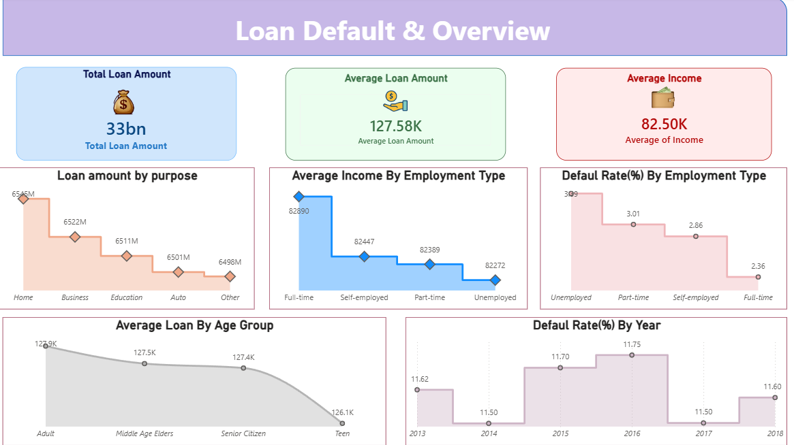
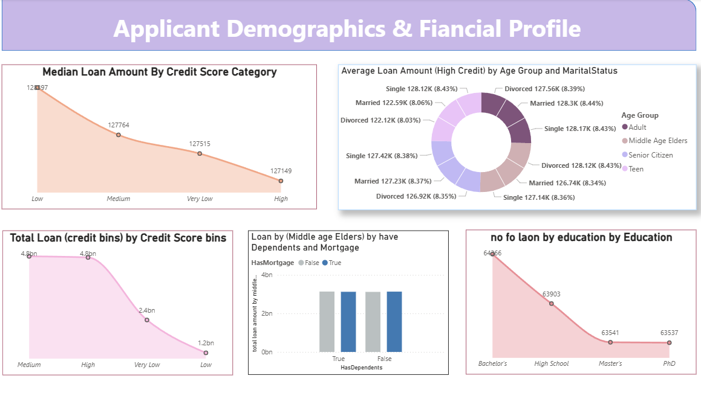
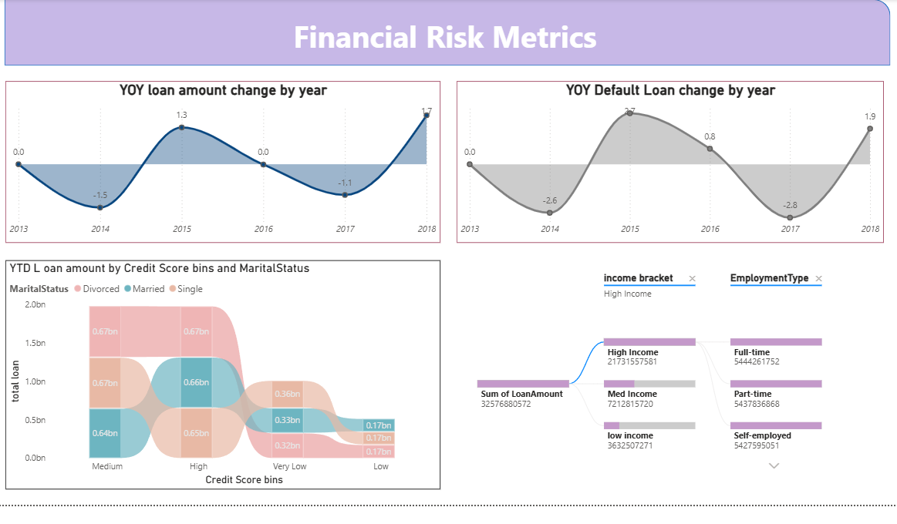

# 📊 Loan Default Analysis | Power BI

## 📌 Overview
An interactive Power BI dashboard that analyzes loan data to uncover insights into loan distribution, applicant demographics, and financial risk. The report consists of three interactive dashboard pages.

## 📄 Dashboard Pages

### 1. Loan Default & Overview
- 💰 Total Loan Amount
- 💵 Average Loan Amount
- 💼 Average Income
- Loan Amount by Purpose
- Average Income by Employment Type
- Default Rate by Employment Type
- Average Loan by Age Group
- Default Rate by Year

### 2. Applicant Demographics & Financial Profile
- Credit Score Analysis
- Age Group & Marital Status Analysis
- Education-wise Loan Distribution
- Dependents & Mortgage Analysis

### 3. Financial Risk Metrics
- Year-over-Year Loan Amount Change
- Year-over-Year Default Loan Change
- Credit Score & Marital Status Analysis
- Income Bracket vs Employment Type (Sankey Diagram)

## 🛠️ Tools & Technologies
- Microsoft Power BI
- Power Query
- DAX
- Google Cloud Services
- Microsoft Excel

## ☁️ Data Source
The dataset was accessed through **Google Cloud Services** and analyzed using Power BI.

## 📸 Dashboard Preview

### Loan Default & Overview

### Applicant Demographics & Financial Profile

### Financial Risk Metrics

